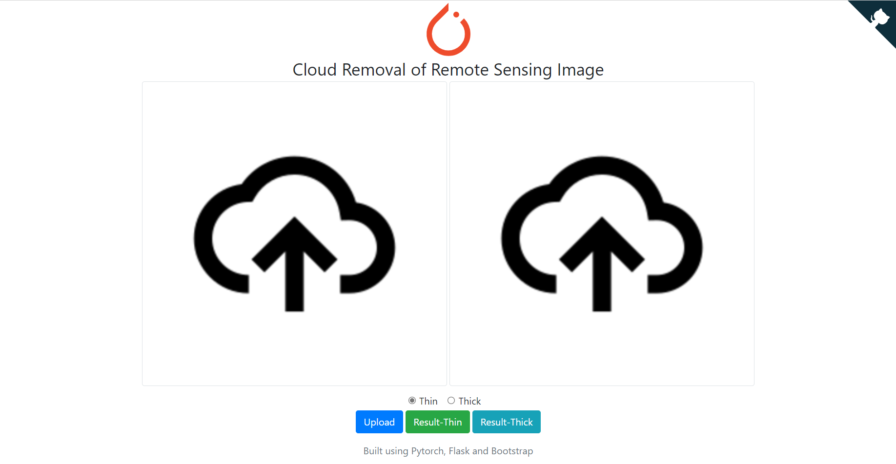

# Introduction
This repo contains a sample code to show how to create a Flask API server by deploying our remote sensing imagery cloud removal PyTorch model that is trained on RICE dataset.
# Demo
> [https://410a2aab7578.ngrok.io/](https://410a2aab7578.ngrok.io/)


# Usage
1. Download the pretrained model.
- For RCIE1 (thin cloud dataset): [model_thin.pth](https://j8rd-my.sharepoint.com/:u:/g/personal/25_t_skings_club/EVw8ftEDszJBrT403aVmmCwBZFPOrNZuYb1pSVyU7MAQzg?e=aatrhv)
- For RCIE2 (thick cloud dateset): [model_thick.path](https://j8rd-my.sharepoint.com/:u:/g/personal/25_t_skings_club/ER8pK0UJrApDjuc0k7kiYi0BXCZZKi9_9MErXmhYk8SJWg?e=qtb8IX)
2. Place the model on root dir.
3. Run `app.py`.
# Deploy
Go to [https://ngrok.com/](https://ngrok.com/), register an account and then you can get an authtoken.
```bash
wget https://bin.equinox.io/c/4VmDzA7iaHb/ngrok-stable-linux-amd64.zip
unzip ngrok-stable-linux-amd64.zip
./ngrok authtoken ***
./ngrok http 9000
```
# Tips
There are many images used for test in `test_thin` and `test_thick` folder.
# Cites
- [Lin D, Xu G, Wang X, et al. A remote sensing image dataset for cloud removal[J]. arXiv 
preprint arXiv:1901.00600, 2019.](https://arxiv.org/abs/1901.00600)
- [Isola P, Zhu J Y, Zhou T, et al. Image-to-image translation with conditional adversarial 
networks[C]//Proceedings of the IEEE conference on computer vision and pattern 
recognition. 2017: 1125-1134.](https://arxiv.org/abs/1611.07004)